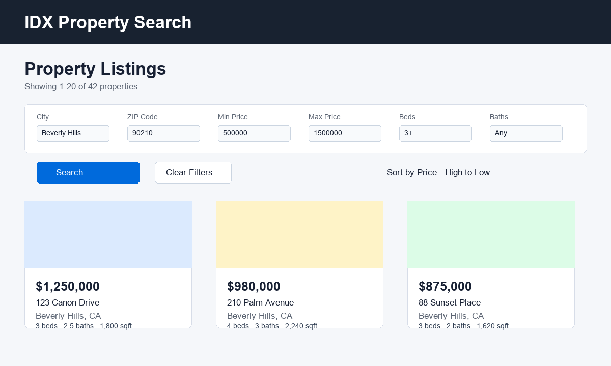

# IDX Property Search Application

Full-stack property search application built for the IDX Exchange SDE Internship. The application lets users search MLS-style property listings, filter and sort results, browse paginated listings, view property details and photo galleries, see mapped locations, and review open house information.

## Screenshot



## Tech Stack

- Frontend: React 19.2, React Router 7.18, React Testing Library, Create React App
- Backend: Node.js, Express 5.2, mysql2, cors, dotenv
- Database: MySQL 8
- Testing: Jest, Supertest, React Testing Library
- Tooling: ESLint, Prettier

## Features

- Property search by city, ZIP code, price range, bedrooms, and bathrooms
- Server-side pagination
- Sorting by price, listing date, square footage, and bedrooms
- Property detail pages with summary information and descriptions
- Property photo carousel and detail gallery
- Property locations displayed with Google Maps
- Open house information
- Error boundary recovery UI for frontend rendering failures
- Backend request logging with status codes and response times
- Input validation and parameterized database queries

## Local Setup

### Prerequisites

Install the following before running the project:

- Node.js 18 or newer
- npm
- MySQL 8
- Git

### Clone the Repository

```bash
git clone <repository-url>
cd IDX-Exchange
```

### Configure the Backend

Navigate to the backend directory and install dependencies:

```bash
cd backend
npm install
```

Create a `backend/.env` file with your local database configuration:

```env
DB_HOST=localhost
DB_PORT=3306
DB_USER=your_mysql_user
DB_PASSWORD=your_mysql_password
DB_NAME=rets
PORT=5000
```

Start the backend:

```bash
npm run dev
```

The API runs at `http://localhost:5000`.

### Configure the Frontend

From the project root:

```bash
cd frontend
npm install
```

The map feature uses a Google Maps API key. Create a frontend/.env file with:

```env
REACT_APP_GOOGLE_MAPS_API_KEY=your_key_here
```

Start the frontend:

```bash
npm start
```

The application runs at `http://localhost:3000`.

The frontend proxies API requests to the backend running on port `5000`.

## Running Tests

### Backend

```bash
cd backend
npm test
```

Run backend tests with coverage:

```bash
npm run test:coverage
```

### Frontend

```bash
cd frontend
npm test -- --watchAll=false
```

Run frontend tests with coverage:

```bash
npm test -- --coverage --watchAll=false
```

### Lint

```bash
cd frontend
npm run lint
```

### Format

```bash
cd frontend
npm run format
```

## Project Structure

```text
IDX-Exchange/
|-- backend/
|   |-- src/
|   |   |-- db/
|   |   |-- routes/
|   |   `-- index.js
|   |-- tests/
|   `-- package.json
|-- frontend/
|   |-- public/
|   |-- src/
|   |   |-- api/
|   |   |-- components/
|   |   |-- hooks/
|   |   |-- pages/
|   |   `-- utils/
|   `-- package.json
|-- .gitignore
`-- README.md
```

## Architecture

The application follows a client-server architecture:

```text
React Frontend
      |
      | HTTP / REST
      v
Express Backend
      |
      | SQL
      v
MySQL Database
```

The React frontend handles the user interface, listing filters, sorting, pagination, property detail navigation, and display state.

The Express backend exposes REST API endpoints and is responsible for validating request parameters, constructing database queries, retrieving property data, and returning JSON responses.

MySQL stores the property and open house data. The frontend never connects directly to the database, keeping database credentials and query logic on the server.

### Query Safety

User-provided filter values are passed through mysql2 placeholders instead of being directly inserted into SQL queries.

Sorting is handled separately because SQL column names cannot be parameterized using placeholders. The backend validates `sortBy` against a fixed whitelist of supported property columns before adding the selected column to the query.

### Frontend State

`ListingsPage` manages listing filters, sorting, pagination, and listing-page state.

When a user opens a property detail page and returns to the listings, React Router location state restores the previous listing context. Page changes preserve the active sorting configuration, while applying new filters resets pagination and sorting.

### Error Handling

The frontend includes an `ErrorBoundary` component to provide a recovery UI when a React rendering error occurs.

API requests also handle unsuccessful HTTP responses and surface errors to the frontend rather than silently failing.

## Database Schema Summary

### `rets_property`

Primary table containing property listings.

Important fields used by the application:

- `L_ListingID`: unique listing identifier used by property detail routes
- `L_SystemPrice`: listing price
- `L_Address`: street address
- `L_City`: city
- `L_State`: state
- `L_Zip`: ZIP code
- `L_Keyword2`: bedroom count
- `LM_Dec_3`: bathroom count
- `LM_Int2_3`: square footage
- `ListingContractDate`: listing date
- `L_Photos`: property photo data
- `LMD_MP_Latitude`: property latitude
- `LMD_MP_Longitude`: property longitude

### `rets_openhouse`

Contains open house information associated with property listings.

Important fields used by the application:

- `L_ListingID`: associates an open house with a property
- `OpenHouseDate`: scheduled open house date
- `OH_StartTime`: start time
- `OH_EndTime`: end time
- `all_data`: additional open house data, including remarks when available

## API Reference

### `GET /api/health`

Checks API and database connectivity.

Example response:

```json
{
  "status": "ok",
  "database": "connected"
}
```

### `GET /api/properties`

Returns a paginated collection of property listings.

Supported query parameters:

- `limit`: number of results to return, from `1` to `100`; default `20`
- `offset`: number of results to skip; default `0`
- `city`: city filter
- `zipcode`: ZIP code filter
- `minPrice`: minimum listing price
- `maxPrice`: maximum listing price
- `beds`: minimum number of bedrooms
- `baths`: minimum number of bathrooms
- `sortBy`: `L_SystemPrice`, `ListingContractDate`, `LM_Int2_3`, or `L_Keyword2`
- `sortOrder`: `ASC` or `DESC`

Example request:

```http
GET /api/properties?city=Beverly%20Hills&minPrice=500000&beds=3&sortBy=L_SystemPrice&sortOrder=DESC
```

Example response:

```json
{
  "total": 42,
  "limit": 20,
  "offset": 0,
  "results": [
    {
      "L_ListingID": "123456",
      "L_City": "Beverly Hills",
      "L_SystemPrice": 1250000
    }
  ]
}
```

Invalid query parameters return HTTP `400`.

Example:

```json
{
  "error": "Invalid sortBy field"
}
```

### `GET /api/properties/:id`

Returns the property associated with the provided `L_ListingID`.

Example request:

```http
GET /api/properties/123456
```

Example response:

```json
{
  "L_ListingID": "123456",
  "L_Address": "123 Canon Drive",
  "L_City": "Beverly Hills",
  "L_SystemPrice": 1250000
}
```

If the property does not exist, the endpoint returns HTTP `404`.

```json
{
  "error": "Property not found",
  "message": "No property exists with ID: 123456"
}
```

### `GET /api/properties/:id/openhouses`

Returns open house records for a property.

Example request:

```http
GET /api/properties/123456/openhouses
```

Example response:

```json
[
  {
    "L_ListingID": "123456",
    "OpenHouseDate": "2026-09-10",
    "OH_StartTime": "13:00:00",
    "OH_EndTime": "16:00:00",
    "all_data": "{\"OpenHouseRemarks\":\"Hosted tour.\"}"
  }
]
```

If the property exists but has no open houses, the endpoint returns an empty array:

```json
[]
```

If the property does not exist, the endpoint returns HTTP `404`.

## Testing Strategy

The project uses automated tests for both backend API behavior and frontend components.

### Backend Tests

Backend route tests use Jest and Supertest with the database layer mocked. Tests cover:

- Paginated property responses
- Property filters
- Sorting validation
- Invalid query parameters
- Property detail responses
- Missing and invalid property IDs
- Open house responses
- Properties without open houses

### Frontend Tests

Frontend tests use Jest and React Testing Library. Tests cover core UI behavior including:

- Property filters
- Pagination
- Property cards and navigation
- API client behavior

Coverage can be generated independently for the backend and frontend using the commands in the Running Tests section.

## Known Issues And Future Improvements

- User authentication is not implemented.
- Saved searches are not currently supported.
- Future improvements could include cloud deployment, broader map-based search, saved searches, and richer open house calendar views.

## Troubleshooting

### Backend Cannot Connect to MySQL

- Confirm MySQL is running.
- Verify the database name and credentials in `backend/.env`.
- Confirm MySQL is listening on the configured `DB_PORT`.
- Restart the backend after changing environment variables.

### Frontend API Requests Fail

- Confirm the backend is running on `http://localhost:5000`.
- Confirm the frontend proxy points to `http://localhost:5000`.
- Restart the React development server after changing environment variables or `package.json`.

### Tests Fail After Dependency Changes

Run:

```bash
npm install
```

in the affected `backend` or `frontend` directory, then run the tests again.

## License

This project was created for educational purposes as part of the IDX Exchange internship program.
